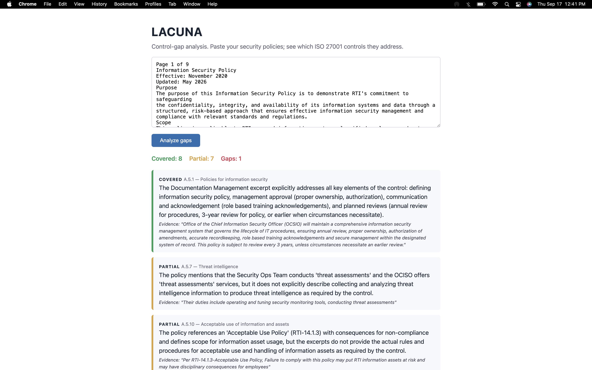

# Lacuna

A control-gap analyzer. Point it at an organization's written security policies and it reports which ISO 27001:2022 controls they address, which they only partially address, and which they miss entirely — with a rationale and cited evidence for each verdict.

## The problem it solves

Gap analysis is a standard GRC task: an organization has a pile of policies, a framework says "you must address X, Y, Z," and someone has to read everything and find what is missing. By hand it is slow and inconsistent. With keyword search it is wrong — a policy that says "staff verify their identity with a second factor" clearly addresses the authentication control, but the word "authentication" never appears, so keyword matching calls it a gap.

That mismatch is why this retrieves by similarity rather than exact string matching. The retrieval here is lexical, so it catches shared and related words but not true paraphrase — the evaluation below shows exactly where that breaks.

## How it works

A set of real ISO 27001:2022 Annex A controls serves as the expected checklist. Pasted policy text is split into chunks and embedded into vectors. For each control, the most similar policy chunks are retrieved by cosine similarity. An LLM reads the control and the retrieved excerpts and returns a verdict — covered, partial, or gap — with a one-line rationale and the most relevant phrase as evidence. A web page shows the verdicts color-coded, with a summary count.

The three-way verdict is the design choice that matters most. Binary covered/not-covered would be dishonest — most real policies touch a control without fully satisfying it. "Partial" is where the actual audit findings live.

## Does it actually work?

I ran it against RTI International's published Information Security Policy (May 2026 version), then reviewed all 16 verdicts myself against the source document to build an answer key.

The first version agreed with my review on **3 of 16 controls**. Almost every miss was retrieval, not reasoning: the model was judging excerpts that didn't contain the relevant section. Awareness training was called a gap while the policy has a full training section, because chunking had split the document at fixed character counts and buried it.

Three changes fixed most of it:

- Split the policy on section headings instead of fixed sizes, and keep the heading in each chunk
- Drop filler words and normalize word endings before hashing, so "information security" doesn't drown out "backup"
- Search on the control's title plus its text, since the title often holds the key word ("Physical entry," "Information backup")

Agreement went to **13 of 16**. `evaluate.py` reproduces this against the answer key.

The three remaining misses are the honest limits:

- **A.5.1 and A.8.5** — retrieval found the right text; the model was more lenient than I was about what counts as missing (management approval, MFA)
- **A.8.24** — lexical matching can't connect "cryptography" to "encryption." This one needs neural embeddings.

A caveat on the number: the answer key and the tuning used the same 16 controls, so 13/16 measures the fix, not how the tool would do on a policy it hasn't seen.

## Stack

Python, Flask, the Anthropic API for the judgment layer, scikit-learn for cosine similarity.

## Honest limitations

The embedding is lexical-semantic, not neural. It uses a deterministic bag-of-words hashing vector, not a trained embedding model. This was a deliberate trade to keep the tool dependency-light and reproducible: retrieval catches word-overlap and near-paraphrase well but misses deep conceptual matches a neural embedding would get. Swapping in a real embeddings API is a one-function change and is the obvious next step. Measured cost of this trade: one of three remaining verdict misses is a pure vocabulary failure the lexical approach cannot fix.

The control set is a representative subset, not all 93 Annex A controls. The pipeline handles the full set unchanged; the subset keeps analysis fast and the demo readable.

The verdict is a judgment, not an authority. The tool accelerates a human reviewer, it does not replace one. "Covered" means the policy plausibly addresses the control's intent, not that the organization is compliant.

No evidence of implementation. Like any policy-based analysis, this checks what the documents say, not what the organization does. Written coverage is necessary but not sufficient for actual control effectiveness.

## What I would add next

Real neural embeddings; the full Annex A control set; support for multiple documents and multiple frameworks; and an export to an audit-ready findings format.
